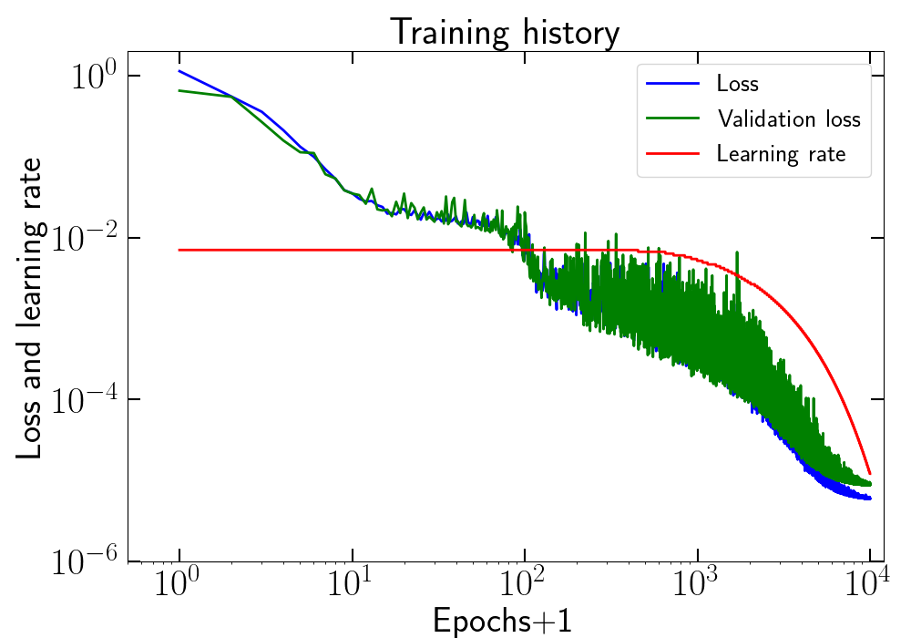
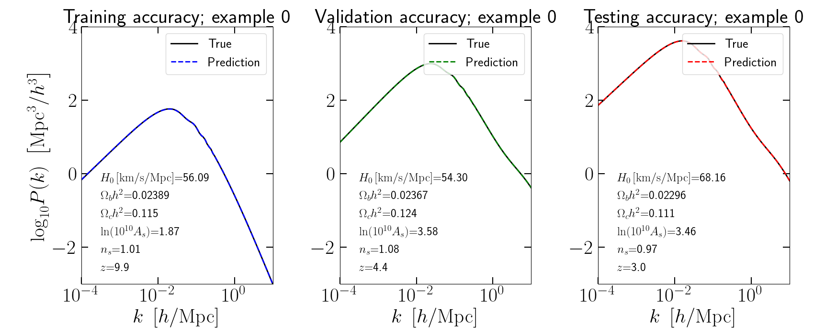
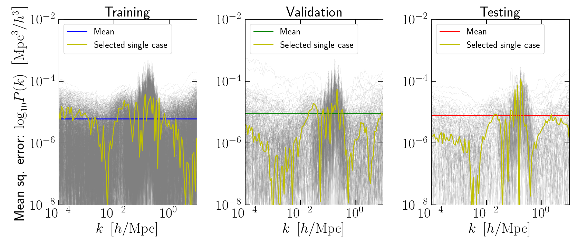
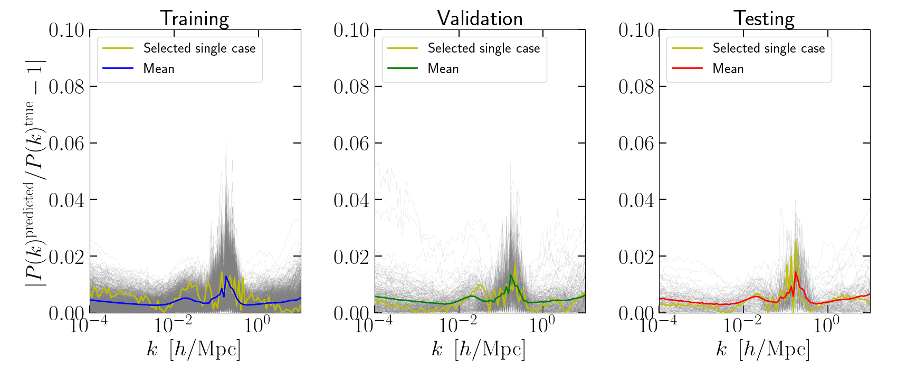

# pk_neuralnetwork_emulator
A set of python scripts for astrophysicists/cosmologists that utilizes a neural network to emulate the power spectrum of nonlinear matter density fluctuations in the Universe. It works as a high-dimensional parameter space interpolator aimed to speed up predictions as a function of cosmological parameters.

The model takes as input the values of the parameters $H_0$, $\Omega_b h^2$, $\Omega_c h^2$, ${\rm ln}A_s10^{10}$, $n_s$ and $z$.

NOTE: this was not extensively optimized, and so as is, it should not be used to produce results for research papers. Rather it can work as a starting point to explore other architectures and training ranges/strategies, generalize to other cosmology quantities (polyspectra, halo mass function), or simply illustrating how to use *python* and *tensorflow* in a concrete cosmology emulation application.

### Table of contents
- [Dependencies](#dependencies)
- [Script overview](#script-overview)
- [Performance overview](#performance-overview)

### Dependencies

- CAMB code (*pip install camb* ; https://camb.readthedocs.io/en/latest/)
- numpy, scipy and matplotlib
- tensorflow

Note: does not require GPU access.

### Overview of the scripts

##### commons.py
This is a parameter file "common" to all other scripts (imported by all). Modify this to set prior parameter ranges, number of training examples and other spectra details.

##### generate_data.py
Executing this script as *python generate_data.py* will generate three latin hypercubes that will be used for training, validation and testing sets. The "features" are the values of the 6 emulator parameters and the "labels" are the log10 of the nonlinear matter power spectrum generated by the CAMB code. The data is saved in *data_store/*.

##### train_model.py
This script defines the neural network model using Keras/Tensorflow and the training parameters (batch size, number of epochs, etc). Execute it as *python train_model.py* to perform the training. The trained model is saved in *model_store/*.

##### plot_performance_model.py
This script loads the trained model and plots a few diagnostics of its peformance: (i) the true vs. predicted results for a specific training/validation/testing example; (ii) the mean squared error for all the training/validation/testing examples; and (iii) the percentage for the same examples. Executing it as *python plot_performance_model.py* will generate the figures and save them in fig_store/.

### Performance overview

This figure shows an example of a training history where the learning rate is progressively reduced (using the *callback* method) to keep "slowly-cooking" the network and improve the optimization of its hyperparameters. 

This figure compares the true spectra (black) and the neural network predictions (colors) for the first example in the training/validation/testing sets. Any differences cannot be distinguished by eye in the scale of the plot.

